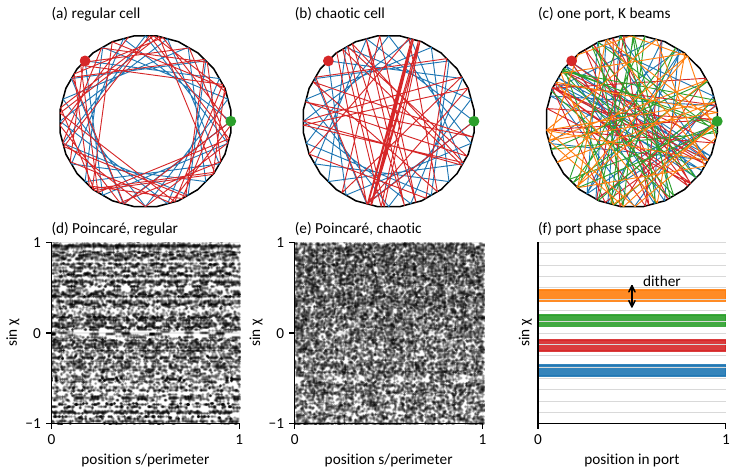
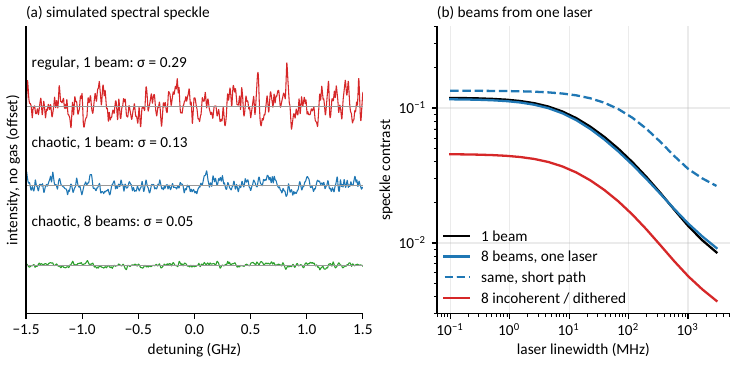

# cmpc-sim

Simulation framework for **chaotic multipass cells (CMPCs)** in free-standing membranes for integrated, coherence-robust
absorption sensing of gases (and liquids): membrane modes and evanescent overlap, in-plane DBR mirrors, ray tracing in
segmented circular cells, a path-resolved speckle (coherence) model, single-port multi-beam injection with beam dithering,
and gas-absorption spectra.

> **Status: research code, simple-model predictions.** The ray/path models are not validated against full-wave
> simulation or measurements, several inputs are assumptions (see [`docs/MODELS.md`](docs/MODELS.md) §9), and the gas-line
> parameters in the repo are **illustrative placeholders, not HITRAN**. Do not quote numbers without checking the
> assumptions they depend on.

Lives in [`misc-applets`](https://github.com/mikkojhuttunen/misc-applets) next to, and built on, the Python reference engines in
`../math-engines` (materials, slab waveguide, Bragg grating, Gaussian beam). The ray-tracing idea follows `../beam-propagation` (JS).

## Layout

```
cmpc/                core library
  cmpc_sim.py          materials, membrane modes (Γ), oblique-incidence TMM mirrors/DBR, segmented cells,
                       ray tracer, Poincaré sections, Lyapunov exponent, ray-table re-weighting, self-test
  coherence_model.py   path-resolved speckle statistics: contrast, autocovariance, K-beam merging, drift noise, spectra
  gas_spectra.py       Voigt lines, mixtures, p(L)-weighted transmission, shot noise, HAPI partition sums
  mirror_design.py     hole-free three-index TE mirror design (differential evolution) and tolerance Monte-Carlo
scripts/             reproducible pipelines (run from the repo root; outputs go to results/)
data/                mirror_designs.json (designs used in the figures); put hitran_lines*.json here
tests/               unit tests (pytest or plain python)
docs/                MODELS.md (equations, assumptions, validation), CHANGELOG.md, TASKLIST.md, figures/
results/             generated pickles and figures (git-ignored)
```

## Install

This folder is meant to sit inside a `misc-applets` checkout, next to `math-engines/`; no submodule or extra path is needed.
Run everything from this folder (`misc-applets/cmpc-sim/`):

```bash
cd misc-applets/cmpc-sim
pip install -r requirements.txt
python tests/test_core.py          # or, from the misc-applets root: pytest cmpc-sim/tests
make figs-nir                      # see the pipeline table below
```
If the folder is moved elsewhere, set `MISC_APPLETS=/path/to/misc-applets`. Tested with Python 3.12, numpy 2.4, scipy 1.17,
matplotlib 3.10. Optional: `pip install hitran-api` (real partition sums, `scripts/fetch_hitran.py`).

## Minimal example

```python
import sys; sys.path.insert(0, "cmpc")
import numpy as np, cmpc_sim as cs, coherence_model as cm

lam = 1.55e-6
m   = cs.membrane_mode("Si", 250e-9, lam, "TM")                     # n_eff, n_g, Γ, penetration depth
dbr = cs.DBR(n_tooth=m.neff, lam_design=lam, N=10, m_gap=1, m_tooth=1, slab_pol="TM")
R   = lambda s: dbr.R(lam, s)                                        # mirror reflectance vs sin(chi)
cell = cs.SegmentedCell(5e-3, 24, curvature=20.0)                    # 1 cm cell, 24 curved facets (rho = 5 cm)
W, th0 = 30e-6, lam / (m.neff * 30e-6)                               # port width, single-mode launch half-angle
tab = cs.trace_rays(cell, W, 3000, 800, th0, theta_c=np.pi/2 - np.pi*7/24, max_path=3.0, seed=1)
alpha = cs.dB_per_cm_to_alpha(0.1)                                   # ASSUMED membrane loss
res = cs.evaluate(tab, R, alpha, m.Gamma)                            # re-weight the same ray table for any mirror/loss
print(f"Γ={m.Gamma:.2f}  T_det={res.T_det:.3f}  <L>={res.L_mean*100:.0f} cm  Γ<L>={res.L_eff_gas*100:.0f} cm")
paths = cm.prepare(tab, R, alpha, m.Gamma, lam, m.neff, m.n_group, W)
print("speckle contrast (1 MHz laser):", round(cm.contrast(paths, 1e6), 3), " output modes M:", round(paths.M_spat()))
```

## Pipelines

| `make` target / script | What it produces | Time |
|---|---|---|
| `make test` | unit tests + built-in self-test (TMM vs engine, Γ vs quadrature, Brewster, tracer geometry) | seconds |
| `scripts/run_figures.py` | 10 figures, Si membrane 1.55 µm: Γ, mirrors TE/TM, thickness trade-off, cells, gas spectra, coherence | ~3 min |
| `scripts/run_midir.py` | Ge/Si membranes at 5.26 µm (NO line): modes, mirrors, TE-hole, chaotic vs regular, detection limits | ~3 min |
| `make mirror` → `scripts/design_mirror.py` | three-index hole-free TE mirror designs → `data/mirror_designs.json` | ~2 min |
| `make chaos` | speckle vs cell perturbation and number of beams, suppression budget (Ge, 5.26 µm) | ~3 min |
| `make multibeam` | long-path single-port multi-beam scan and figures (Si, 1.55 µm) | ~5 min |
| `make single-port` | K separate ports vs one port with K angles / sub-apertures | ~4 min |
| `make proposal-figs` | the 17 cm wide, ≥10 pt vector figures used in the proposal | ~5 min |
| `make lines-mir` | fetch real HITRAN mid-IR lines (needs internet + `hitran-api`) and rank NO lines by selectivity | minutes |

## Results snapshot (simple model, Si TM₀ 250 nm membrane, 1.55 µm, 30 µm port, curved facets; see caveats)

| Quantity | Value | Depends on |
|---|---|---|
| Γ (TM₀, 250 nm) | 0.64 | exact slab mode |
| TE₀ vs TM₀ mirror | TE has a Brewster hole (⟨1−R⟩ ≈ 7 %); TM mirror loss ≈ 3×10⁻⁴ | polarisation mapping (p vs s) |
| Long-path design (assumed 0.04 dB/cm) | ⟨L⟩ = 83 cm, Γ⟨L⟩ = 53 cm, −10 dB detected | **assumed membrane loss**, 3×10⁻⁴ bounce loss |
| Contrast, regular → chaotic cell | 0.29 → 0.115 (M ≈ 10 → 63) | ray statistics |
| K independent beams in one port | 0.081 / 0.063 / 0.044 / 0.032 for K = 2 / 4 / 8 / 16 | distinct input modes |
| Path per beam, K = 8 | one port 0.97, K ports 0.64 | port-limited regime |
| Beams from one laser, simultaneous | **no gain** at any linewidth | cross-beam coherence |




## Things worth knowing before you use or extend it
* **Polarisation mapping.** For a *vertical trench* mirror, slab **TE** (E in the membrane plane) is **p-polarised**
  (Brewster window), slab **TM** (E_z) is **s-polarised**. Version 0.1 had this swapped; it is fixed and tested.
* **Independent beams must occupy distinct input modes** (angle cells of width λ/(n_eff w) or non-overlapping
  sub-apertures). `merge_incoherent` *assumes* independence; it cannot detect that two beams are identical.
* **Gas lines are placeholders.** Run `make lines-mir` (and the near-IR equivalent) to replace them with HITRAN;
  `select_lines.py` results on placeholders are meaningless. Ge Sellmeier coefficients were entered from memory: verify.
* **Mirror = 1D effective-index model.** Slot radiation, TE↔TM conversion at trenches, thickness steps and sidewall
  roughness are not modelled (lumped into `bounce_loss`); full-wave work is listed in `docs/TASKLIST.md`.

## License and citation
No license chosen yet (add one before publishing). `misc-applets` and any HITRAN line files have their own terms
(HITRAN requires citation of the database). Citation entry: TODO.
